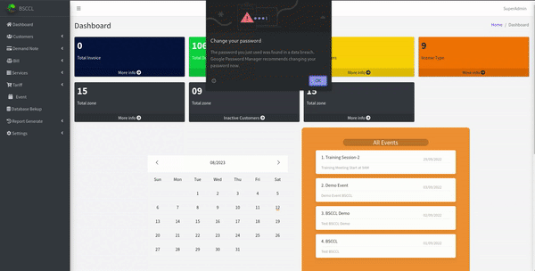

# BSCCL Billing System

  

## 🚀 Overview

Welcome to the BSCCL Billing System – a prestigious government project developed to revolutionize bill management and financial operations for the Bangladesh Submarine Cable Company Limited (BSCCL). This system is designed to handle complex calculations with unparalleled accuracy, ensuring the utmost precision in every transaction.

Check out how the BSCCL Billing System works in action:

## 🌟 Why Use the BSCCL Billing System

In the dynamic landscape of financial operations, the BSCCL Billing System offers several key benefits that make it indispensable:

- **Precision and Accuracy:** Achieve billing accuracy to the highest degree, minimizing errors and discrepancies that can arise from manual calculations.
- **Operational Efficiency:** Streamline bill management processes, reducing administrative workload and freeing resources for strategic tasks.
- **Insights for Decision-Making:** Leverage advanced reporting capabilities to gain insights into revenue patterns, customer behaviors, and financial performance, enabling data-driven decisions.
- **Security of Financial Data:** Safeguard sensitive financial information through robust encryption and access controls, ensuring compliance with data security regulations.

## 📝 How to Use the BSCCL Billing System

Using the BSCCL Billing System is designed to be straightforward and efficient:

1. **Login:** Access the system using your authorized credentials.
2. **Billing Entry:** Enter billing details accurately, ensuring all relevant information is captured.
3. **Automated Calculations:** Allow the system to handle complex calculations, ensuring accuracy and minimizing manual effort.
4. **Invoice Generation:** Generate polished invoices with precise charge breakdowns.
5. **Reporting:** Explore the reporting section for detailed financial insights and performance analysis.

## 🔄 Before and After Using the BSCCL Billing System

Before the adoption of the BSCCL Billing System, bill management and financial operations were characterized by manual calculations, increased error rates, and time-consuming administrative tasks. With the implementation of this system:

- Billing accuracy reaches unprecedented levels, minimizing financial discrepancies.
- Operational efficiency improves as automation reduces manual workload.
- Decision-making becomes data-driven through insightful reports on revenue and customer behavior.
- Sensitive financial data remains secure with robust encryption and access controls.

## 📦 BSCCL Package

The BSCCL Billing System comes bundled with an array of comprehensive features:

- 💼 **Billing Management:** Seamlessly manage billing operations for million-dollar transactions, generating detailed invoices and tracking payments.
- 🧮 **Automated Calculations:** Perform complex calculations effortlessly, minimizing manual effort and ensuring precision.
- 📊 **Reporting and Analysis:** Access customizable reports for in-depth financial analysis and informed decision-making.
- 📋 **Customer Information:** Maintain a secure database of customer details and billing history for enhanced service.
- 👤 **Enhanced User Roles:** Assign roles and permissions to users for controlled access and streamlined workflow.
- 📜 **Audit Trail:** Keep track of all billing activities and changes for transparency and accountability.
- 💱 **Multi-Currency Support:** Handle international transactions with ease through support for multiple currencies.
- 🚀 **Scalability:** The system is designed to accommodate growing volumes of billing transactions without compromising performance.
- 🔄 **Seamless Integration:** Integrate with existing systems and tools, ensuring smooth workflows and data consistency.

## 🛠️ Technical Specifications

- 📡 **Technology Stack:** The system is built using cutting-edge technologies, ensuring stability, security, and scalability.
- 🚀 **Deployment:** The system can be deployed on-premises or on cloud infrastructure for flexibility.
- 🛠️ **Maintenance and Support:** Regular updates and maintenance ensure the system's reliability and continued performance.

## 📊 Reporting Capabilities

- 📄 **Customizable Reports:** Create tailored reports to meet specific financial analysis needs.
- 📈 **Real-time Insights:** Gain real-time insights into billing trends, payment statuses, and outstanding balances.
- 📊 **Visual Representations:** Visualize data with charts and graphs for better comprehension.

## 📚 User Training and Support

- 📘 **Training Resources:** Access user guides and training materials for effective system usage.
- 📞 **Dedicated Support:** Receive timely assistance from the BSCCL IT Department for any technical queries or issues.

## 📄 License

This government project is protected by a private license and is developed exclusively for the operations of the Bangladesh Submarine Cable Company Limited (BSCCL).

For inquiries or additional information, please contact [BSCCL IT Department](mailto:it@bsccl.com).
